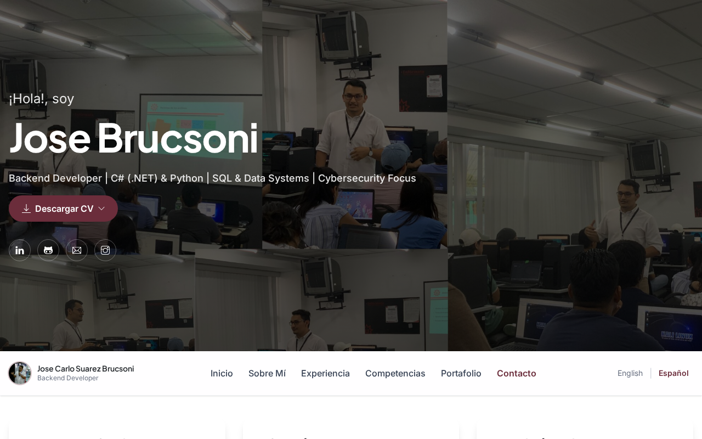

# José Carlo Suárez Brucsoni

Sitio de **portfolio y CV**. Backend Developer | C# (.NET) y Python | SQL | ciberseguridad. Santa Cruz de la Sierra, Bolivia.



**Sitio:** [https://jose-brucsoni.github.io/](https://jose-brucsoni.github.io/)

<div align="center">

[](https://www.linkedin.com/in/jose-carlo-suarez-brucsoni-5588ba272)
[](https://github.com/jose-brucsoni)
[](mailto:joseca6520@gmail.com)

</div>

---

## Sobre mí

Backend Developer con **2+ años** en sistemas orientados a datos con **C# (.NET)** y **SQL Server**. Diseñé el módulo de **Cuentas por Cobrar (CXC)** de **DANTE** en UTEPSA (flujos de cobro para **50+** usuarios; menos procesamiento manual). Optimización de consultas (de minutos a segundos), reportes y Android con Firebase. Amplío **Python** y ciberseguridad. Abierto a trabajo remoto.

El detalle del prototipo público de DANTE está en el repo `DANTE` (demo); el sistema interno no se publica completo.

---

## Stack

C# · .NET · Python · SQL Server · REST · Git · Firebase · Android · Java

---

## Experiencia

### Analista de sistema — UTEPSA *(julio 2023 – presente)*

- Módulo CXC de DANTE: cobro y gestión financiera, **50+** usuarios, **10.000+** registros/día.
- SQL Server (**20+** tablas); consultas de ~10 min a ~10 s.
- **10+** reportes (retención, pagos, inscripciones).

### Auxiliar de laboratorio de redes y sistemas — UTEPSA *(agosto 2020 – junio 2023)*

- Web de soporte e inventario (~80% menos carga manual).
- **72** workstations, **21** laboratorios.
- **10+** talleres de ciberseguridad, hacking ético y Git (**50+** estudiantes).

### Freelance *(enero 2019 – julio 2020)*

- **Encuentrame:** Android + Firebase; ~120 descargas locales; pausado.
- **Anglarill Fitness:** app de nutrición (el repo público es prototipo visual + esqueleto Android).

---

## Educación

UTEPSA — Ingeniería en Sistemas (2021 – dic. 2026). Colegio Henry Prince — Bachiller (2016).

---

## Este sitio (desarrollo local)

```bash
npm install
npm run dev    # Tailwind con watch
npm run build  # CSS de producción
```

---

## Contacto

[joseca6520@gmail.com](mailto:joseca6520@gmail.com) · [LinkedIn](https://www.linkedin.com/in/jose-carlo-suarez-brucsoni-5588ba272) · [GitHub](https://github.com/jose-brucsoni) · +591 70918874

Uso personal y académico, salvo acuerdo distinto.
